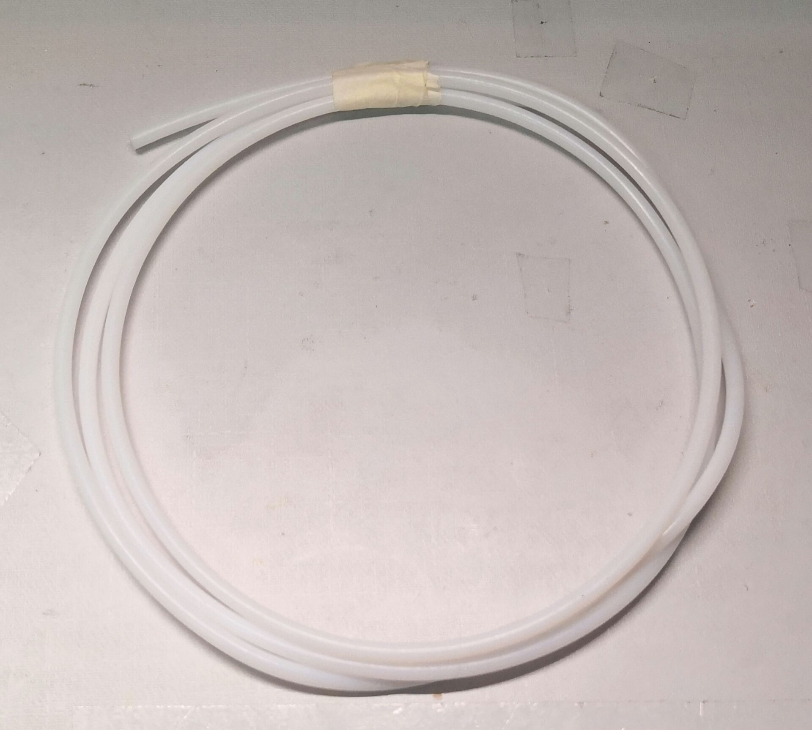
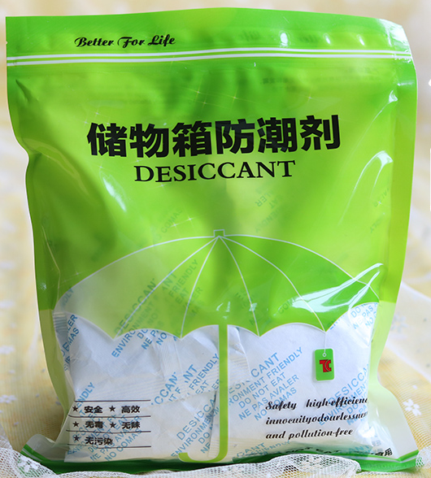
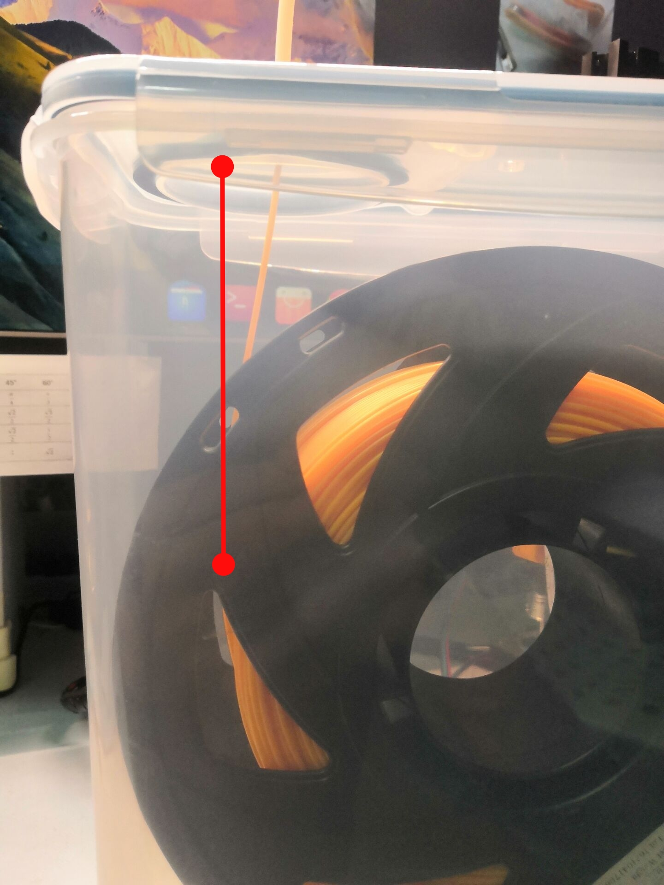

## 材料准备

| 材料         | |  数量     | 链接 |
| ------------ | :------- | ---- | ---- |
| 密封收纳盒 4L |  | 1 |[日本家用防虫防潮大号4L密封罐面粉桶五谷杂粮密封收纳盒米桶米缸](https://m.tb.cn/h.fYsICUX)|
| 气动快插头 M6 |  | 2 | [3D打印机配件气动快速插头远程送料管快接头1.75/3.0挤出机快接头](https://item.taobao.com/item.htm?spm=a1z09.2.0.0.24ad2e8dDTNr03&id=610569261201&_u=5d8i0fp68f6) |
| 送料管       |  |  长度按需    |[3D打印机配件 铁氟龙管 远程挤出喷头送料管导料管 四氟管 PTFE管](https://item.taobao.com/item.htm?spm=a1z09.2.0.0.24ad2e8dDTNr03&id=613273402221&_u=5d8i0fp7a60)|
| 608轴承 |  | 4 |[鲁泰小轴承](https://m.tb.cn/h.f1pJw1m)|
| 干燥剂 |  | 1 |[小包收纳箱干燥剂行李箱防潮剂防霉包除湿剂吸湿](https://m.tb.cn/h.fX9g7Fe)|
| 温湿度计[可选] |  | 1 |[小米米家蓝牙温湿度计2](https://m.tb.cn/h.fYHgNsa)|

以上材料除了尺寸合适的收纳盒不太好找外，其他可以自己挑便宜的买，本人是因为还有别的材料要买，一起凑运费。

## 安装

首先，如图所示，取下盒子上的小盖板。

接着用手钻...宿舍怎么会有手钻啊？摔！

在如图所示位置，先用尖头螺丝钻孔，然后更换螺丝从小到大一点一点扩开。

注意打孔打在红点标注的位置，不要像我一样打在正中间。料丝与开口平行出料会顺滑一些。

接下来再把两个快接头分别拧在盖板和挤出机上。

料盘架我用的是这个：[T站链接](https://www.thingiverse.com/thing:2047554)  
打印出来安装，可以参考这个视频：[3D打印新手指南——一款小巧的3D打印料盘架和一款设计很棒的3D打印耗材](https://www.bilibili.com/video/BV1GT4y1T7r4?spm_id_from=333.999.0.0)

然后把料盘架和干燥剂以及料盘都放进盒子里。

按需裁剪一节送料管（可以用小刀割开，用剪刀或者钳子会把管口压扁）插在两个快接头上，把料穿出去就大功告成了！

放了几个小时湿度到了39%，最终稳定在了25%左右。

可以看一下之前料受潮时打的一个虹膜盒，打印出来很多气泡，叶片和内壁粘在一起根本拧不开。

对比一下还是很明显的。

本教程如有改动会更新在[这里](https://github.com/Khala-Yang/3D-printing/blob/main/DIY%E5%B9%B2%E7%87%A5%E7%9B%92/DIY%E5%B9%B2%E7%87%A5%E7%9B%92.md)。
